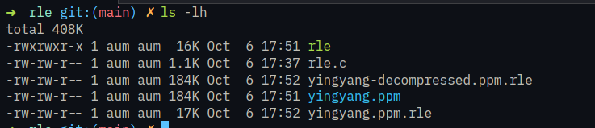

- Run Length Encoding(RLE) is a type of compression/decompression algorithm.
	- it basically takes the repeating characters and add count of it next to it.
	- for eg. => str = "aaaabbcccc"
	- using rle(str) => a4b2c4 or 4a2b4c

- RUN COMMAND - `gcc -o rle rle.c -Wall
- ./rle compress|decompress < {filename} > {output_name}`

